# File System Agent - System Architecture Flowchart

## System Overview
This flowchart represents the architecture of an advanced AI agent that combines file system analysis with natural language processing to provide intelligent insights about directory structures and file metadata.

## Key Components

### **File System Agent (Advanced Agent)**
- **Purpose**: AI-powered file system analysis and question answering
- **Pattern**: Scan → Analyze → Question → AI Response
- **Technology**: OpenAI GPT integration with file system operations
- **Complexity**: Advanced, sophisticated, production-ready

### **Streamlit Web Interface**
- **Purpose**: Modern web interface for the file system agent
- **Pattern**: User Input → Agent Processing → Visual Results
- **Technology**: Streamlit framework with interactive components

---

## System Architecture Flowchart

```mermaid
graph TD
    %% User Interface Layer
    subgraph UI ["🎨 User Interface Layer"]
        CLI[Command Line Interface]
        WEB[Streamlit Web Interface]
        SIDEBAR[Configuration Sidebar]
        INPUT[User Input Forms]
        RESULTS[Results Display]
        VISUAL[Interactive Visualizations]
    end

    %% Agent Layer
    subgraph AGENT ["🤖 File System Agent"]
        FA[File System Agent<br/>AI-Powered Analysis]
        FA_INIT[Initialize OpenAI Client]
        FA_CONFIG[Configure Agent Settings]
    end

    %% Processing Layer
    subgraph PROCESSING ["⚙️ Processing Layer"]
        FS_SCAN[File System Scanner]
        AI_ANALYSIS[AI Question Analysis]
        CALC_ENGINE[Calculation Engine]
        DATA_PROCESS[Data Processing]
        ERROR_HANDLE[Error Handling]
    end

    %% Data Layer
    subgraph DATA ["💾 Data Layer"]
        FILE_SYSTEM[Local File System]
        OPENAI_API[OpenAI GPT API]
        FILE_INFO[File Metadata Cache]
        CONFIG[Configuration Store]
    end

    %% External Services
    subgraph EXTERNAL ["🌐 External Services"]
        AI_SERVICE[OpenAI GPT Service]
    end

    %% Flow Connections
    %% User Input Flows
    CLI --> FA
    WEB --> FA
    SIDEBAR --> FA_INIT
    INPUT --> FA
    
    %% Agent Initialization
    FA --> FA_INIT
    FA_INIT --> FA_CONFIG
    FA_CONFIG --> CONFIG
    
    %% File System Analysis Flow
    FA --> FS_SCAN
    FS_SCAN --> FILE_SYSTEM
    FILE_SYSTEM --> FILE_INFO
    FILE_INFO --> DATA_PROCESS
    
    %% AI Analysis Flow
    DATA_PROCESS --> AI_ANALYSIS
    AI_ANALYSIS --> OPENAI_API
    OPENAI_API --> AI_SERVICE
    AI_SERVICE --> AI_ANALYSIS
    
    %% Response Processing
    AI_ANALYSIS -->|Simple Question| RESULTS
    AI_ANALYSIS -->|Complex Calculation| CALC_ENGINE
    CALC_ENGINE --> FILE_INFO
    CALC_ENGINE --> RESULTS
    
    %% Web Interface Flow
    WEB --> SIDEBAR
    SIDEBAR --> FA
    FA --> RESULTS
    RESULTS --> VISUAL
    VISUAL --> WEB
    
    %% Error Handling
    FS_SCAN -->|Error| ERROR_HANDLE
    AI_ANALYSIS -->|Error| ERROR_HANDLE
    ERROR_HANDLE --> RESULTS
    
    %% Styling
    classDef uiLayer fill:#e1f5fe,stroke:#01579b,stroke-width:2px
    classDef agentLayer fill:#f3e5f5,stroke:#4a148c,stroke-width:2px
    classDef processingLayer fill:#e8f5e8,stroke:#1b5e20,stroke-width:2px
    classDef dataLayer fill:#fff3e0,stroke:#e65100,stroke-width:2px
    classDef externalLayer fill:#fce4ec,stroke:#880e4f,stroke-width:2px

    class CLI,WEB,SIDEBAR,INPUT,RESULTS,VISUAL uiLayer
    class FA,FA_INIT,FA_CONFIG agentLayer
    class FS_SCAN,AI_ANALYSIS,CALC_ENGINE,DATA_PROCESS,ERROR_HANDLE processingLayer
    class FILE_SYSTEM,OPENAI_API,FILE_INFO,CONFIG dataLayer
    class AI_SERVICE externalLayer
```



## Detailed Component Flow

### **File System Agent Execution Flow**


### **Streamlit Web Interface Flow**


### **AI Question Analysis Flow**


## Data Flow Patterns

### **AI Agent Pattern**
1. **Input**: User provides folder path and natural language question
2. **Data Collection**: Recursively scan file system and collect metadata
3. **AI Analysis**: Send question and context to OpenAI GPT
4. **Processing**: Execute calculations or provide direct answers
5. **Output**: AI-generated response with insights and visualizations

### **Web Interface Pattern**
1. **Configuration**: User sets up API key and preferences
2. **Input**: User selects folder and enters question
3. **Processing**: Background agent execution with progress indicators
4. **Display**: Interactive results with charts, tables, and statistics

### **Calculation Engine Pattern**
1. **Question Analysis**: AI determines if calculation is needed
2. **Expression Generation**: Create Python expression for calculation
3. **Safe Execution**: Execute in controlled environment
4. **Result Formatting**: Format and display results

## Key Features

| Feature | Description | Implementation |
|---------|-------------|----------------|
| **File System Scanning** | Recursive directory analysis | Pathlib with error handling |
| **AI Question Answering** | Natural language processing | OpenAI GPT integration |
| **Calculation Engine** | Complex mathematical operations | Safe Python expression execution |
| **Web Interface** | Modern interactive UI | Streamlit with real-time updates |
| **Error Handling** | Graceful failure management | Comprehensive error catching |
| **Data Visualization** | Charts and statistics | Streamlit components |

## Technology Stack

- **Python**: Core programming language
- **OpenAI GPT**: AI-powered question answering
- **Streamlit**: Modern web interface framework
- **Pathlib**: File system operations
- **Requests**: HTTP client for API calls

## Learning Objectives

This agent demonstrates:
- **Advanced AI Integration**: OpenAI GPT for natural language processing
- **Complex Data Processing**: File system analysis and metadata collection
- **Web Application Development**: Modern UI with Streamlit
- **Calculation Engine**: Safe execution of dynamic expressions
- **Error Handling**: Comprehensive error management
- **Performance Optimization**: Efficient file system traversal

## Code Structure

```python
class FileSystemAgent:
    def __init__(self, api_key: str):
        # Initialize OpenAI client
        
    def scan_directory(self, root_path: str):
        # Recursively scan file system
        
    def answer_question(self, question: str, file_info: dict):
        # AI-powered question answering
        
    def create_summary(self, file_info: dict):
        # Generate human-readable summary
```

## Example Usage

### **Command Line**
```bash
python file_agent.py /path/to/folder "What is the total size of all files?"
```

### **Web Interface**
```bash
streamlit run streamlit_app.py
```

### **Example Output**
```
Scanning directory: /path/to/folder
Question: What is the total size of all files?
Answer: Result: 2.5 MB (2,621,440 bytes)
```

## Architecture Benefits

- **AI-Powered**: Natural language question understanding
- **Comprehensive**: Full file system analysis capabilities
- **Interactive**: Modern web interface with real-time updates
- **Extensible**: Modular design for easy enhancement
- **Production-Ready**: Robust error handling and performance
- **Educational**: Demonstrates advanced agent patterns

## Security Considerations

- **API Key Management**: Secure handling of OpenAI credentials
- **File System Access**: Controlled directory scanning with user consent
- **Data Privacy**: Local processing without external data transmission
- **Input Validation**: Sanitization of user inputs and file paths
- **Safe Execution**: Controlled environment for dynamic code execution

---

*This agent represents the advanced tier of AI agent development, combining sophisticated data analysis with natural language processing capabilities.* 