# Hello Agent - System Architecture Flowchart

## System Overview
This flowchart represents the architecture of a multi-tier AI agent system, from basic API integration to sophisticated file system analysis with AI-powered question answering.

## Key Components

### **Tier 1: Hello Agent (Basic Agent)**
- **Purpose**: Demonstrates fundamental agent pattern
- **Pattern**: Input → API Call → Process → Output
- **Technology**: HTTP requests to external APIs

### **Tier 2: File System Agent (Advanced Agent)**
- **Purpose**: AI-powered file system analysis
- **Pattern**: Scan → Analyze → Question → AI Response
- **Technology**: OpenAI GPT integration with file system operations

### **Tier 3: Streamlit Interface (Web UI)**
- **Purpose**: Modern web interface for file system agent
- **Pattern**: User Input → Agent Processing → Visual Results
- **Technology**: Streamlit framework with interactive components

---

## System Architecture Flowchart

```mermaid
graph TD
    %% User Interface Layer
    subgraph UI ["🎨 User Interface Layer"]
        CLI[Command Line Interface]
        WEB[Streamlit Web Interface]
        SIDEBAR[Configuration Sidebar]
        INPUT[User Input Forms]
        RESULTS[Results Display]
    end

    %% Agent Layer
    subgraph AGENTS ["🤖 Agent Layer"]
        HA[Hello Agent<br/>Basic API Integration]
        FA[File System Agent<br/>AI-Powered Analysis]
        HA_INIT[Initialize Agent]
        FA_INIT[Initialize OpenAI Client]
    end

    %% Processing Layer
    subgraph PROCESSING ["⚙️ Processing Layer"]
        HA_PROC[Weather Data Processing]
        FS_SCAN[File System Scanner]
        AI_ANALYSIS[AI Question Analysis]
        CALC_ENGINE[Calculation Engine]
    end

    %% Data Layer
    subgraph DATA ["💾 Data Layer"]
        WEATHER_API[OpenWeatherMap API]
        FILE_SYSTEM[Local File System]
        OPENAI_API[OpenAI GPT API]
        FILE_INFO[File Metadata Cache]
    end

    %% External Services
    subgraph EXTERNAL ["🌐 External Services"]
        WEATHER[Weather Data Service]
        AI_SERVICE[OpenAI GPT Service]
    end

    %% Flow Connections
    %% User Input Flows
    CLI --> HA
    WEB --> FA
    SIDEBAR --> FA_INIT
    INPUT --> FA

    %% Agent Initialization
    HA --> HA_INIT
    FA --> FA_INIT
    FA_INIT --> OPENAI_API

    %% Hello Agent Flow
    HA_INIT --> HA_PROC
    HA_PROC --> WEATHER_API
    WEATHER_API --> WEATHER
    WEATHER --> HA_PROC
    HA_PROC --> CLI

    %% File System Agent Flow
    FA --> FS_SCAN
    FS_SCAN --> FILE_SYSTEM
    FILE_SYSTEM --> FILE_INFO
    FILE_INFO --> AI_ANALYSIS
    AI_ANALYSIS --> OPENAI_API
    OPENAI_API --> AI_SERVICE
    AI_SERVICE --> AI_ANALYSIS
    AI_ANALYSIS --> CALC_ENGINE
    CALC_ENGINE --> FILE_INFO
    CALC_ENGINE --> RESULTS

    %% Web Interface Flow
    WEB --> SIDEBAR
    SIDEBAR --> FA
    FA --> RESULTS
    RESULTS --> WEB

    %% Decision Points
    FS_SCAN -->|Error| ERROR[Error Handling]
    AI_ANALYSIS -->|Calculation Required| CALC_ENGINE
    AI_ANALYSIS -->|Direct Answer| RESULTS

    %% Styling
    classDef uiLayer fill:#e1f5fe,stroke:#01579b,stroke-width:2px
    classDef agentLayer fill:#f3e5f5,stroke:#4a148c,stroke-width:2px
    classDef processingLayer fill:#e8f5e8,stroke:#1b5e20,stroke-width:2px
    classDef dataLayer fill:#fff3e0,stroke:#e65100,stroke-width:2px
    classDef externalLayer fill:#fce4ec,stroke:#880e4f,stroke-width:2px
    classDef errorLayer fill:#ffebee,stroke:#c62828,stroke-width:2px

    class CLI,WEB,SIDEBAR,INPUT,RESULTS uiLayer
    class HA,FA,HA_INIT,FA_INIT agentLayer
    class HA_PROC,FS_SCAN,AI_ANALYSIS,CALC_ENGINE processingLayer
    class WEATHER_API,FILE_SYSTEM,OPENAI_API,FILE_INFO dataLayer
    class WEATHER,AI_SERVICE externalLayer
    class ERROR errorLayer
```

## Detailed Component Flow

### **Hello Agent Flow**

### **File System Agent Flow**

### **Streamlit Web Interface Flow**

## Data Flow Patterns

### **Simple Agent Pattern (Hello Agent)**
1. **Input**: User provides city name
2. **API Call**: HTTP request to weather service
3. **Processing**: Parse JSON response
4. **Output**: Formatted weather information

### **AI Agent Pattern (File System Agent)**
1. **Input**: User provides folder path and question
2. **Data Collection**: Scan file system and collect metadata
3. **AI Analysis**: Send question and data to OpenAI
4. **Processing**: Execute calculations or provide direct answers
5. **Output**: AI-generated response with insights

### **Web Interface Pattern (Streamlit)**
1. **Configuration**: User sets up API key and preferences
2. **Input**: User selects folder and enters question
3. **Processing**: Background agent execution
4. **Display**: Interactive results with charts and tables

## Key Features by Component

| Component | Key Features | Technology Stack |
|-----------|-------------|------------------|
| **Hello Agent** | Basic API integration, Error handling, Interactive CLI | Python, Requests, JSON |
| **File System Agent** | AI-powered analysis, Complex calculations, Natural language Q&A | Python, OpenAI GPT, Pathlib |
| **Streamlit Interface** | Modern web UI, Real-time processing, Interactive visualizations | Streamlit, Pandas, Plotly |

## Error Handling & Edge Cases

- **API Failures**: Graceful degradation with error messages
- **Permission Errors**: Skip inaccessible files with warnings
- **Invalid Input**: User-friendly validation and guidance
- **Network Issues**: Timeout handling and retry logic
- **Large Directories**: Progress indicators and memory management

## Security Considerations

- **API Key Management**: Secure input and environment variable usage
- **File System Access**: Controlled directory scanning with user consent
- **Data Privacy**: Local processing without external data transmission
- **Input Validation**: Sanitization of user inputs and file paths 