# Hello Agent - System Architecture Flowchart

## System Overview
This flowchart represents the architecture of a basic AI agent that demonstrates the fundamental pattern: **Input → API Call → Process → Output**.

## Key Components

### **Hello Agent (Basic Agent)**
- **Purpose**: Demonstrates fundamental agent pattern
- **Pattern**: Input → API Call → Process → Output
- **Technology**: HTTP requests to external APIs
- **Complexity**: Simple, focused, educational

---

## System Architecture Flowchart

```mermaid
graph TD
    %% User Interface Layer
    subgraph UI ["🎨 User Interface"]
        CLI[Command Line Interface]
        INPUT[User Input: City Name]
        OUTPUT[Formatted Weather Display]
    end

    %% Agent Layer
    subgraph AGENT ["🤖 Hello Agent"]
        HA[Hello Agent<br/>Basic API Integration]
        HA_INIT[Initialize Agent]
        HA_CONFIG[Configure API Settings]
    end

    %% Processing Layer
    subgraph PROCESSING ["⚙️ Data Processing"]
        HA_PROC[Weather Data Processing]
        HA_FORMAT[Format Response]
        HA_ERROR[Error Handling]
    end

    %% Data Layer
    subgraph DATA ["💾 Data Layer"]
        WEATHER_API[OpenWeatherMap API]
        API_CONFIG[API Configuration]
        RESPONSE_CACHE[Response Cache]
    end

    %% External Services
    subgraph EXTERNAL ["🌐 External Service"]
        WEATHER[Weather Data Service]
    end

    %% Flow Connections
    %% User Input Flow
    CLI --> INPUT
    INPUT --> HA
    
    %% Agent Initialization
    HA --> HA_INIT
    HA_INIT --> HA_CONFIG
    HA_CONFIG --> API_CONFIG
    
    %% Main Processing Flow
    HA --> HA_PROC
    HA_PROC --> WEATHER_API
    WEATHER_API --> WEATHER
    WEATHER --> HA_PROC
    
    %% Response Processing
    HA_PROC --> HA_FORMAT
    HA_FORMAT --> OUTPUT
    OUTPUT --> CLI
    
    %% Error Handling
    HA_PROC -->|Error| HA_ERROR
    HA_ERROR --> OUTPUT
    
    %% Styling
    classDef uiLayer fill:#e1f5fe,stroke:#01579b,stroke-width:2px
    classDef agentLayer fill:#f3e5f5,stroke:#4a148c,stroke-width:2px
    classDef processingLayer fill:#e8f5e8,stroke:#1b5e20,stroke-width:2px
    classDef dataLayer fill:#fff3e0,stroke:#e65100,stroke-width:2px
    classDef externalLayer fill:#fce4ec,stroke:#880e4f,stroke-width:2px

    class CLI,INPUT,OUTPUT uiLayer
    class HA,HA_INIT,HA_CONFIG agentLayer
    class HA_PROC,HA_FORMAT,HA_ERROR processingLayer
    class WEATHER_API,API_CONFIG,RESPONSE_CACHE dataLayer
    class WEATHER externalLayer
```



## Detailed Component Flow

### **Hello Agent Execution Flow**


### **Error Handling Flow**


## Data Flow Patterns

### **Simple Agent Pattern**
1. **Input**: User provides city name via command line
2. **API Call**: HTTP GET request to OpenWeatherMap API
3. **Processing**: Parse JSON response and extract relevant data
4. **Formatting**: Create user-friendly output with emojis
5. **Output**: Display formatted weather information

### **Error Handling Pattern**
1. **API Failure**: Catch network or API errors
2. **Error Processing**: Create meaningful error messages
3. **User Feedback**: Display helpful error information
4. **Graceful Degradation**: Continue operation when possible

## Key Features

| Feature | Description | Implementation |
|---------|-------------|----------------|
| **API Integration** | Weather data fetching | HTTP requests to OpenWeatherMap |
| **Error Handling** | Graceful failure management | Try-catch with user messages |
| **Data Processing** | JSON response parsing | Dictionary access and formatting |
| **User Interface** | Interactive CLI | Input/output with emojis |
| **Configuration** | API key management | Environment variables |

## Technology Stack

- **Python**: Core programming language
- **Requests**: HTTP client for API calls
- **JSON**: Data format for API responses
- **OpenWeatherMap API**: Free weather data service

## Learning Objectives

This agent demonstrates:
- **Basic API Integration**: HTTP requests and response handling
- **Error Management**: Graceful handling of failures
- **Data Processing**: JSON parsing and formatting
- **User Interface**: Command-line interaction patterns
- **Agent Architecture**: Simple input-process-output pattern

## Code Structure

```python
class HelloAgent:
    def __init__(self):
        # Initialize API configuration
        
    def get_weather(self, city: str):
        # Make API call and handle errors
        
    def process_weather_data(self, data):
        # Parse and format response
        
    def run(self, city: str):
        # Main execution flow
```

## Example Usage

```bash
# Run the agent
python hello_agent.py

# Example output
🤖 Hello Agent - Minimal AI Agent Demo
==================================================

📍 Querying weather for: London
🤖 Hello Agent is fetching weather data for: London
🌍 Weather in London, GB:
🌡️  Temperature: 15.2°C
☁️  Conditions: Partly cloudy
💧 Humidity: 65%
```

## Architecture Benefits

- **Simplicity**: Easy to understand and modify
- **Educational**: Perfect for learning agent patterns
- **Focused**: Single responsibility principle
- **Extensible**: Foundation for more complex agents
- **Reliable**: Robust error handling

---

*This agent serves as the foundation for understanding AI agent architecture, demonstrating the essential patterns without complexity.* 